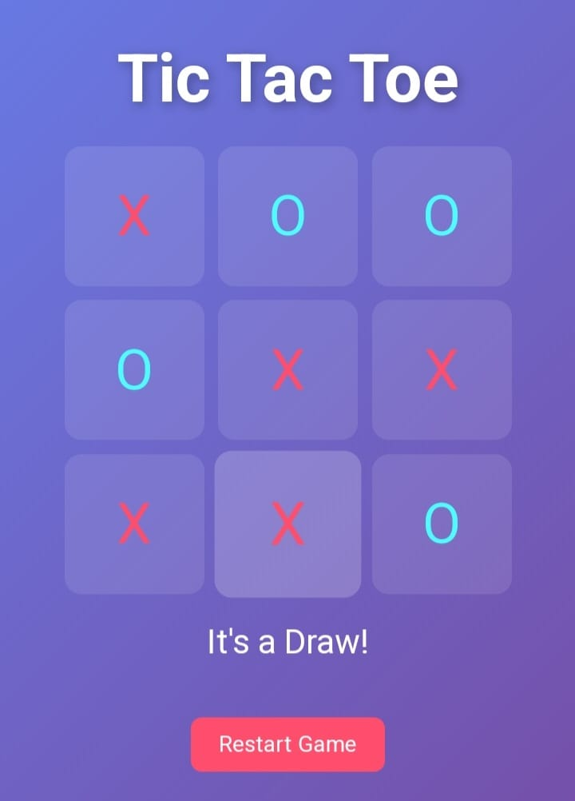
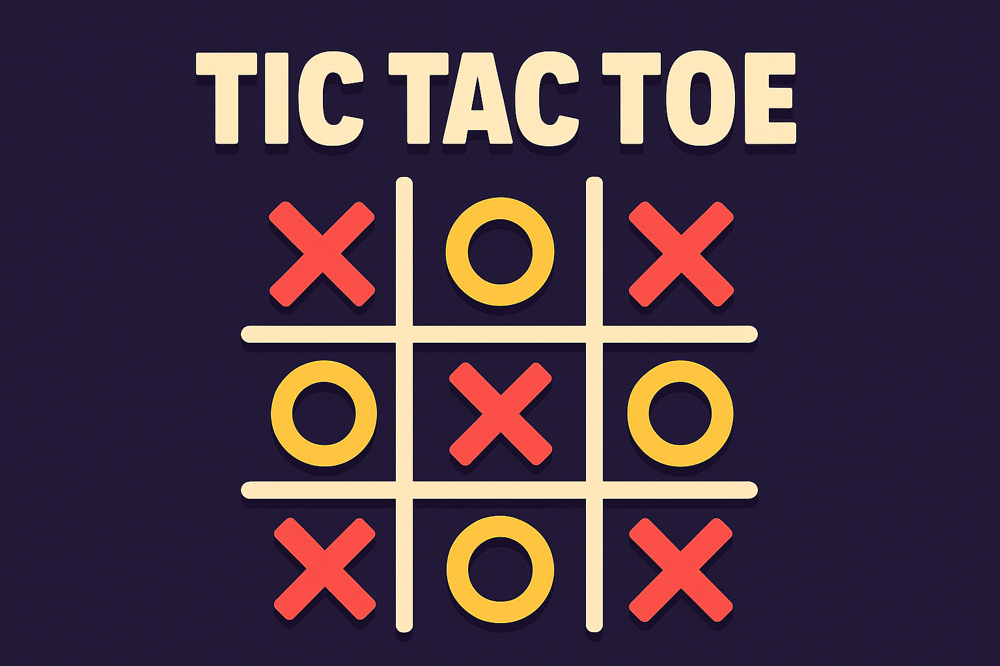

# 🎮 TIC TAC TOE

A fun and interactive Tic Tac Toe game built using **HTML**, **CSS**, and **JavaScript**.  
Play against a friend and relive the classic logic challenge — now in a sleek and animated web version!

---

## 🚀 Live Demo  
👉 **Play Now on https://tictactoeenjoy.netlify.app/**  

---

## 🖼️ Preview  

  

---

## 🧩 Features
- 🎨 Clean and modern UI  
- ⚡ Smooth animations and transitions  
- 🔊 Sound effects for moves and wins  
- 🧠 Win detection logic  
- 🔁 Reset and replay support  

---

## 🛠️ Built With
- **HTML5** – Game structure  
- **CSS3** – Styling and animations  
- **JavaScript (ES6)** – Game logic  

---

🧑‍💻 Author

@ Subhankar Guha
🔗 GitHub Profile - https://github.com/Sguha77

---

  

⭐ If you like this project, consider giving it a star on GitHub!
